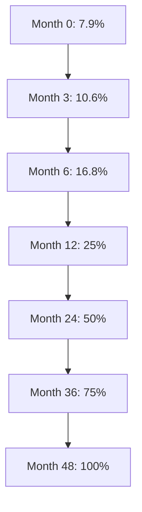

# NLOV Token Complete Information Package
*For Exchanges, Market Makers, and Investors*

## 1. Token Utility & Use Cases

### 1.1 Core Token Functions
```typescript
interface TokenUtility {
    compute: {
        payment: "Payment for GPU compute resources",
        discount: "Up to 30% discount vs fiat payments",
        priority: "Higher compute allocation priority"
    },
    
    staking: {
        node: {
            validator: "500,000 NLOV minimum",
            enterprise: "200,000 NLOV minimum",
            professional: "50,000 NLOV minimum"
        },
        rewards: {
            base: "8-35% APY based on tier",
            bonus: "Up to 50% additional for early stakers",
            compound: "Auto-compound option available"
        }
    },
    
    governance: {
        voting: "1 NLOV = 1 vote",
        proposal: "100,000 NLOV to submit proposals",
        quorum: "10% of circulating supply",
        execution: "24-hour timelock"
    },
    
    platform: {
        access: "Platform feature access tiers",
        fees: "Trading fee discounts up to 50%",
        listing: "AI model listing rights",
        rewards: "Platform revenue sharing"
    }
}
```

### 1.2 Token Value Accrual
```typescript
interface ValueAccrual {
    burn: {
        transaction: "2% of all transaction fees",
        platform: "10% of revenue quarterly buyback & burn",
        unused: "Ecosystem tokens after 3 years"
    },
    
    demand: {
        compute: "Required for all platform transactions",
        staking: "Lock-up through node operations",
        governance: "Active participation requirements",
        utility: "Platform access and discounts"
    }
}
```

## 2. Emission & Unlock Schedule

### 2.1 Monthly Token Emission (First 12 Months)
```typescript
interface MonthlyEmission {
    month1: {
        newUnlock: 3.5M,
        sources: [
            "Public sale linear: 1.5M",
            "Presale linear: 0.8M",
            "Ecosystem: 0.7M",
            "Liquidity: 0.5M"
        ],
        totalCirculating: "43M (8.6%)"
    },
    month2: {
        newUnlock: 4.2M,
        sources: [
            "Public sale linear: 1.5M",
            "Presale linear: 0.8M",
            "Private linear: 1.2M",
            "Ecosystem: 0.7M"
        ],
        totalCirculating: "47.2M (9.4%)"
    },
    // Continues monthly through month 12
    month12: {
        newUnlock: 15.8M,
        sources: [
            "Team first unlock: 7M",
            "Treasury: 2.5M",
            "Development: 1.8M",
            "Ecosystem: 4.5M"
        ],
        totalCirculating: "125M (25%)"
    }
}
```

### 2.2 Milestone Triggers
```typescript
interface MilestoneTriggers {
    team: [
        {
            milestone: "100,000 Active Users",
            unlock: "25% of team allocation (18.75M)",
            expectedTime: "Month 12-15"
        },
        {
            milestone: "$10M Platform Revenue",
            unlock: "25% of team allocation (18.75M)",
            expectedTime: "Month 15-18"
        },
        {
            milestone: "Mainnet Launch",
            unlock: "25% of team allocation (18.75M)",
            expectedTime: "Month 18-24"
        }
    ],
    
    development: [
        {
            milestone: "WebGPU Integration",
            unlock: "20% of development fund",
            expectedTime: "Q2 2025"
        },
        {
            milestone: "AI Marketplace Launch",
            unlock: "20% of development fund",
            expectedTime: "Q3 2025"
        }
    ]
}
```

## 3. Market Making & Trading Parameters

### 3.1 Initial Market Making Requirements
```typescript
interface MarketMaking {
    liquidity: {
        minimumDepth: "$2M total order book depth",
        spreadTarget: "Maximum 1.5% in normal conditions",
        slippageLimit: "Maximum 3% for $50K trade"
    },
    
    obligations: {
        uptime: "99.9% quote presence",
        rebalancing: "Every 10 minutes",
        reporting: "Daily liquidity reports"
    },
    
    parameters: {
        pairs: ["NLOV/USDC", "NLOV/SOL"],
        minSize: "$100K per side",
        priceDeviation: "Max 1% from index"
    }
}
```

### 3.2 Trading Protection Mechanisms
```typescript
interface TradingProtection {
    launch: {
        day1: {
            maxTrade: "5% of holdings per tx",
            dailyLimit: "15% of holdings",
            cooldown: "4 hours between large sales"
        },
        week1: {
            maxTrade: "10% of holdings per tx",
            dailyLimit: "25% of holdings",
            cooldown: "2 hours between large sales"
        }
    },
    
    ongoing: {
        whaleLimit: "Max 1% of daily volume per tx",
        priceImpact: "Dynamic slippage based on size",
        volatilityCircuit: "15% move = 30min pause"
    }
}
```

## 4. Financial Projections & Metrics

### 4.1 Token Economics
```typescript
interface TokenMetrics {
    valuation: {
        initialMarketCap: "$2.76M",
        fullyDilutedValue: "$35M",
        firstYearTarget: "$50M FDV"
    },
    
    liquidityMetrics: {
        initialLPValue: "$2M",
        targetDailyVolume: "$500K-$1M",
        healthMetrics: {
            targetLiquidity: "> $5M by month 3",
            volumeRatio: "0.2-0.5 daily vol/MC",
            depth: "> $100K per 1% price move"
        }
    }
}
```

### 4.2 Revenue Projections
```typescript
interface RevenueProjections {
    year1: {
        Q1: "$500K platform revenue",
        Q2: "$1.2M platform revenue",
        Q3: "$2.5M platform revenue",
        Q4: "$5M platform revenue"
    },
    tokenomicsImpact: {
        burn: "~2M tokens in Y1",
        buyback: "$920K worth in Y1",
        staking: "40% supply staked target"
    }
}
```

## 5. Exchange Integration Requirements

### 5.1 Technical Integration
```typescript
interface TechnicalRequirements {
    contract: {
        type: "SPL Token (Solana)",
        address: "[CONTRACT_ADDRESS]",
        decimals: 9
    },
    
    integration: {
        custody: "Multi-sig required",
        withdrawal: "Manual approval > $100K",
        monitoring: "Real-time balance tracking"
    },
    
    security: {
        audit: "CertiK, Hacken completed",
        insurance: "$5M coverage",
        multisig: "5/8 signers required"
    }
}
```

### 5.2 Listing Requirements
```typescript
interface ListingRequirements {
    timing: {
        announcement: "7 days notice",
        deposit: "3 days prior",
        trading: "Synchronized global launch"
    },
    
    marketing: {
        budget: "$100K per major CEX",
        activities: [
            "Joint AMA sessions",
            "Trading competitions",
            "Staking programs"
        ],
        support: "24/7 dedicated team"
    }
}
```

## 6. Visual Representations

### 6.1 Token Unlock Schedule
```mermaid
gantt
    title Token Unlock Schedule
    dateFormat YYYY-MM
    section Initial
    TGE Unlock (7.9%)    :milestone, 2024-12
    section Public
    Sale Vesting Complete (18%) :2024-12, 2025-06
    section Team
    Cliff Period     :2024-12, 2025-12
    Team Vesting     :2025-12, 2027-12
    section Ecosystem
    Ecosystem Vesting :2024-12, 2028-12
```

### 6.2 Circulating Supply Growth


## 7. Additional Documents Available Upon Request

1. Smart Contract Audit Reports
2. Legal Opinion Letter
3. Token Classification Analysis
4. Market Making Agreement Template
5. Detailed Financial Models
6. Technical Integration Guide
7. Security Protocol Documentation
8. Governance Framework Details
