WELL-STRUCTURED ELEMENTS:
✅ Clear allocation percentages
✅ Defined vesting periods
✅ Progressive price increase
✅ Reasonable TGE unlock (11.96%)
✅ Long-term vesting for team/strategic
✅ Good cliff periods

AREAS NEEDING REFINEMENT:

1. CEX Listing Details:
```
Current: Just allocation mentioned
Need to Add:
- Lock-up period
- Vesting schedule
- TGE unlock %
- Market making allocation
- Order book depth requirements
```

2. Strategic Partnerships:
```
Current: "Case-by-case basis"
Need to Specify:
- Minimum cliff period
- Standard vesting template
- Maximum TGE unlock
- Performance-based unlocks
```

3. Liquidity Specifications:
```
Current: Basic vesting schedule
Need to Add:
- Initial DEX liquidity amount
- LP token lock period
- AMM pool ratios
- Liquidity mining allocations
- Cross-chain liquidity provisions
```

4. Public Sale Structure:
```
Current: 50% TGE, 1-month vesting
Recommendations:
- Add anti-dump measures
- Include maximum per-wallet allocation
- Define transfer restrictions post-TGE
- Add price protection mechanics
```

5. Missing Technical Details:
```
NEEDED ADDITIONS:
1. Token Contract:
   - Mint/burn functions
   - Transfer restrictions
   - Emergency pause mechanism
   - Upgrade capability

2. Vesting Contract:
   - Release mechanisms
   - Emergency functions
   - Admin controls
   - Multi-sig requirements

3. Price Protection:
   - Maximum sell limits
   - Trading cool-downs
   - Whale protection
```

6. Governance Elements:
```
Add:
- Voting rights
- Proposal thresholds
- Time locks
- Emergency DAO controls
```

7. Additional Recommendations:
```
1. Add Utility Metrics:
   - Staking APY ranges
   - Fee distribution mechanism
   - Governance power calculation

2. Market Making:
   - Dedicated MM allocation
   - Slippage controls
   - Volatility parameters

3. Emergency Scenarios:
   - Market crash protocols
   - Hack response plan
   - Emergency shutdown procedure
```

Improvements: 

1. PUBLIC SALE RESTRUCTURE

Current Issues:
- 50% TGE unlock is high
- 1-month vesting is too short
- No dump protection

Improved Structure:
```
Public Sale (14% - 70M tokens)
- TGE: 25% (instead of 50%)
- Month 1: 15%
- Month 2: 15%
- Month 3: 15%
- Month 4: 15%
- Month 5: 15%

Additional Protection:
- Max wallet: 1% of public allocation
- Daily sell limit: 10% of holdings
- 48-hour trading cooldown post-listing
- Dynamic vesting based on price impact
```

2. CEX LISTING PARAMETERS (4% - 20M tokens)

Current Issues:
- No defined unlock schedule
- No market making allocation
- No liquidity requirements

Improved Structure:
```
CEX Listing Allocation Split:
- Initial Liquidity: 40% (8M tokens)
  • TGE: 100% (locked in order books)
  • 6-month exchange lock

- Market Making: 30% (6M tokens)
  • Monthly release: 16.66% over 6 months
  • Price stability mandate
  • Depth requirements: $100K min per price level

- Future Exchange Reserve: 30% (6M tokens)
  • 12-month cliff
  • Quarterly release thereafter
```

3. PROTECTION MECHANISMS

A. Price Protection:
```
1. Circuit Breakers:
   - 15% price drop: 1-hour cool-down
   - 25% price drop: 4-hour cool-down
   - 40% price drop: 24-hour cool-down

2. Sell Limits:
   - Tier 1 (>1% holdings): Max 5% daily
   - Tier 2 (0.5-1% holdings): Max 10% daily
   - Tier 3 (<0.5% holdings): Max 20% daily
```

B. Liquidity Protection:
```
1. Initial DEX Offering:
   - 80% of raised funds to liquidity
   - 2-year LP token lock
   - Minimum LP depth: $500K

2. Market Making:
   - 24/7 coverage
   - Max spread: 1.5%
   - Min order book depth: $200K
```

4. REVISED VESTING SCHEDULE

```mermaid
gantt
    title Revised Token Release Schedule
    dateFormat MM
    axisFormat %M

    section Public Sale (70M)
    TGE 25%: milestone, 0, 0
    Monthly Release: 0, 5

    section CEX Listing (20M)
    Initial Liquidity: milestone, 0, 0
    MM Release: 0, 6
    Reserve: after 12, 12

    section Core (Team/Treasury)
    Team Vesting: after 12, 36
    Treasury Vesting: after 4, 36

    section Ecosystem
    Ecosystem Fund: after 5, 48
    Staking Rewards: 0, 48

```



5. IMPLEMENTATION REQUIREMENTS

```solidity
// Key Contract Functions
function transfer(address to, uint256 amount) public override returns (bool) {
    require(!isTransferLimited(), "Transfers limited");
    require(checkDailyLimit(msg.sender, amount), "Exceeds daily limit");
    require(checkWalletLimit(to, amount), "Exceeds wallet limit");
    
    if(isPriceImpactTooHigh(amount)) {
        trigger_cooldown();
    }
    
    super.transfer(to, amount);
}

// Protection Mechanisms
function isPriceImpactTooHigh(uint256 amount) internal view returns (bool) {
    uint256 impact = calculatePriceImpact(amount);
    return impact > MAXIMUM_IMPACT;
}

function checkDailyLimit(address sender, uint256 amount) internal view returns (bool) {
    return dailyTransfers[sender] + amount <= getDailyLimit(sender);
}
```

6. MONITORING & CONTROL

```javascript
Critical Metrics to Monitor:
1. Price Impact per Trade
2. Wallet Concentration
3. Daily Volume per Holder
4. Liquidity Depth
5. Order Book Imbalance

Alert Triggers:
- Large Wallet Accumulation (>0.5% supply)
- Unusual Trading Patterns
- Liquidity Pool Imbalances
- High Velocity Transfers
```

