 Token Unlock Schedules 

```mermaid
gantt
    title Token Unlock & Vesting Schedule (500M Total Supply)
    dateFormat MM
    axisFormat %M

    section Initial Sales
    Public Sale (70M - 14%): 0, 1
    Presale (15M - 3%): 0, 4
    
    section Core Team & Ops
    Team (80M - 16%) : after 12M, 36M
    Treasury (75M - 15%): after 4M, 36M
    R&D (20M - 4%): after 3M, 36M
    
    section Ecosystem
    Ecosystem Fund (100M - 20%): after 5M, 48M
    Staking (40M - 8%): 0, 48M
    Liquidity (30M - 6%): 0, 12M
    
    section Others
    Marketing (20M - 4%): 0, 24M
    Strategic (20M - 4%): after 12M, 36M
    Advisors (10M - 2%): after 6M, 24M
    CEX Listing (20M - 4%): milestone, 0, 0

```




Detailed Unlock Schedule:

1. TGE (11.96% - 59.8M tokens):
```
- Public Sale: 35M (50% of 70M)
- Treasury: 7.5M (10% of 75M)
- R&D: 2M (10% of 20M)
- Ecosystem: 5M (5% of 100M)
- Marketing: 2M (10% of 20M)
- Liquidity: 6M (20% of 30M)
- Staking: 2M (5% of 40M)
- Pre-sales: 0.3M (20% of combined pre-sales)
```

2. TGE+3M: 15.5% (77.5M tokens)
```
Additional unlocks from:
- Public Sale: Remaining 35M completed
- Pre-sales: Linear vesting continues
- Treasury: Linear starts after cliff
- Marketing: Linear vesting
- Liquidity: Linear vesting
```

3. TGE+6M: 19.5% (97.5M tokens)
```
Additional unlocks from:
- All pre-sales completed
- Advisor vesting begins
- Treasury linear continues
- R&D linear continues
- Ecosystem linear starts
```

4. TGE+12M: 28% (140M tokens)
```
Additional unlocks:
- Liquidity fully unlocked
- Team vesting begins
- Strategic partnerships begin
- Marketing 50% unlocked
```

5. TGE+24M: 45% (225M tokens)
```
Additional unlocks:
- Marketing fully unlocked
- Advisors fully unlocked
- Team 33% unlocked
- Treasury 55% unlocked
```

6. TGE+36M: 85% (425M tokens)
```
Additional unlocks:
- Team fully unlocked
- Treasury fully unlocked
- Strategic fully unlocked
- R&D fully unlocked
```

7. TGE+48M: 100% (500M tokens)
```
All tokens unlocked:
- Ecosystem fully unlocked
- Staking fully unlocked
```

