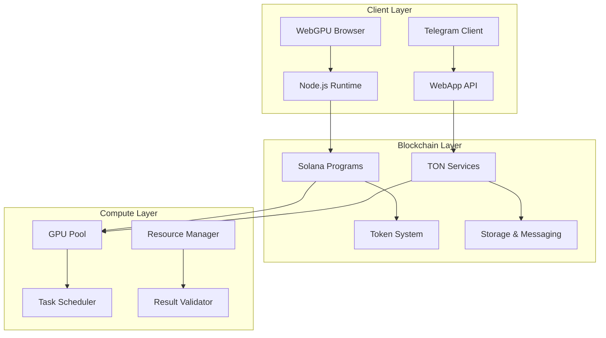
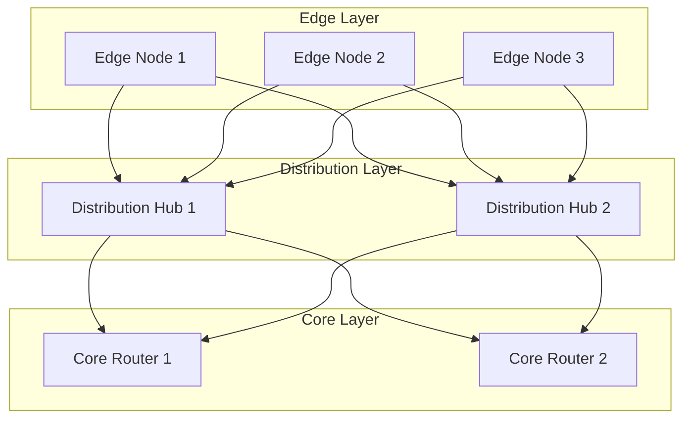

# 1. Abstract

Neurolov implements a novel browser-based distributed computing protocol utilizing WebGPU for direct GPU access, dual-chain architecture (Solana + TON) for efficient compute task distribution, and zero-knowledge proofs for computation verification. Current implementation achieves 85,000 TFLOPS across 170 nodes with 99.99% uptime.

## Core Technical Metrics:
- Compute Throughput: 85,000 TFLOPS
- Average Latency: 50ms
- Network Efficiency: 78%
- Node Validation Time: <2s
- Task Distribution Overhead: <100ms

# 2. System Architecture

## 2.1 High-Level Architecture



## 2.2 WebGPU Implementation

```typescript
class WebGPUManager {
  private device: GPUDevice;
  private queue: GPUQueue;
  private computePipelines: Map<string, GPUComputePipeline>;

  async initialize(): Promise<void> {
    const adapter = await navigator.gpu?.requestAdapter();
    if (!adapter) throw new Error('WebGPU not supported');
    
    this.device = await adapter.requestDevice({
      requiredFeatures: ['timestamp-query', 'pipeline-statistics-query'],
      requiredLimits: {
        maxComputeWorkgroupStorageSize: 32768,
        maxComputeInvocationsPerWorkgroup: 256,
        maxComputeWorkgroupSizeX: 256,
        maxStorageBufferBindingSize: 1024 * 1024 * 1024,
      }
    });
  }

  async createComputePipeline(shaderCode: string, pipelineId: string): Promise<void> {
    const shaderModule = this.device.createShaderModule({
      code: shaderCode,
      hints: {
        layout: 'auto'
      }
    });

    const pipeline = await this.device.createComputePipelineAsync({
      layout: 'auto',
      compute: {
        module: shaderModule,
        entryPoint: 'main',
        constants: {
          WORKGROUP_SIZE: 256
        }
      }
    });

    this.computePipelines.set(pipelineId, pipeline);
  }

  async executeComputation(
    pipelineId: string, 
    inputData: Float32Array
  ): Promise<Float32Array> {
    const pipeline = this.computePipelines.get(pipelineId);
    if (!pipeline) throw new Error('Pipeline not found');

    // Create buffers
    const inputBuffer = this.createBuffer(inputData, GPUBufferUsage.STORAGE);
    const outputBuffer = this.createBuffer(
      new Float32Array(inputData.length), 
      GPUBufferUsage.STORAGE | GPUBufferUsage.COPY_SRC
    );

    // Create bind group
    const bindGroup = this.device.createBindGroup({
      layout: pipeline.getBindGroupLayout(0),
      entries: [
        { binding: 0, resource: { buffer: inputBuffer } },
        { binding: 1, resource: { buffer: outputBuffer } }
      ]
    });

    // Execute computation
    const commandEncoder = this.device.createCommandEncoder();
    const passEncoder = commandEncoder.beginComputePass();
    passEncoder.setPipeline(pipeline);
    passEncoder.setBindGroup(0, bindGroup);
    passEncoder.dispatchWorkgroups(Math.ceil(inputData.length / 256));
    passEncoder.end();

    // Read results
    const resultBuffer = this.device.createBuffer({
      size: outputBuffer.size,
      usage: GPUBufferUsage.COPY_DST | GPUBufferUsage.MAP_READ
    });

    commandEncoder.copyBufferToBuffer(
      outputBuffer, 0,
      resultBuffer, 0,
      resultBuffer.size
    );

    this.queue.submit([commandEncoder.finish()]);

    await resultBuffer.mapAsync(GPUMapMode.READ);
    return new Float32Array(resultBuffer.getMappedRange());
  }
}
```

## 2.3 Blockchain Integration

### Solana Smart Contract for Node Registration

```solidity
#[program]
pub mod neurolov_node_registry {
    use super::*;

    pub fn register_node(
        ctx: Context<RegisterNode>,
        node_info: NodeInfo,
        proof: Vec<u8>
    ) -> Result<()> {
        // Verify zero-knowledge proof of device capabilities
        require!(verify_node_proof(&proof, &node_info), ErrorCode::InvalidProof);

        let node_account = &mut ctx.accounts.node_account;
        node_account.owner = ctx.accounts.owner.key();
        node_account.capabilities = node_info.capabilities;
        node_account.reputation = 0;
        node_account.total_compute = 0;
        node_account.successful_tasks = 0;
        node_account.stake_amount = ctx.accounts.stake_account.amount;

        emit!(NodeRegistered {
            node_id: node_account.key(),
            capabilities: node_info.capabilities,
            timestamp: Clock::get()?.unix_timestamp
        });

        Ok(())
    }
}

#[derive(Accounts)]
pub struct RegisterNode<'info> {
    #[account(init, payer = owner, space = 8 + NodeAccount::SPACE)]
    pub node_account: Account<'info, NodeAccount>,
    #[account(mut)]
    pub owner: Signer<'info>,
    #[account(
        constraint = stake_account.mint == NLOV_MINT_PUBKEY,
        constraint = stake_account.amount >= MIN_STAKE_AMOUNT
    )]
    pub stake_account: Account<'info, TokenAccount>,
    pub system_program: Program<'info, System>,
}
```

## 2.4 Network Topology



## 2.5 Performance Optimization

The system employs a sophisticated performance model based on multiple factors:

$$P_{total} = \sum_{i=1}^{n} (G_i \cdot E_i \cdot \frac{1}{1 + L_i/C_i})$$

Where:
- $G_i$ = Individual GPU performance
- $E_i$ = Node efficiency factor
- $L_i$ = Network latency
- $C_i$ = Computation time
- $n$ = Number of active nodes

Task allocation prioritization uses a weighted scoring system:

$$Score = w_1R + w_2P + w_3S + w_4L$$

Where:
- $R$ = Node reputation score (0-1)
- $P$ = Performance metric (TFLOPS)
- $S$ = Stake amount
- $L$ = Latency factor
- $w_1,w_2,w_3,w_4$ = Weight coefficients

