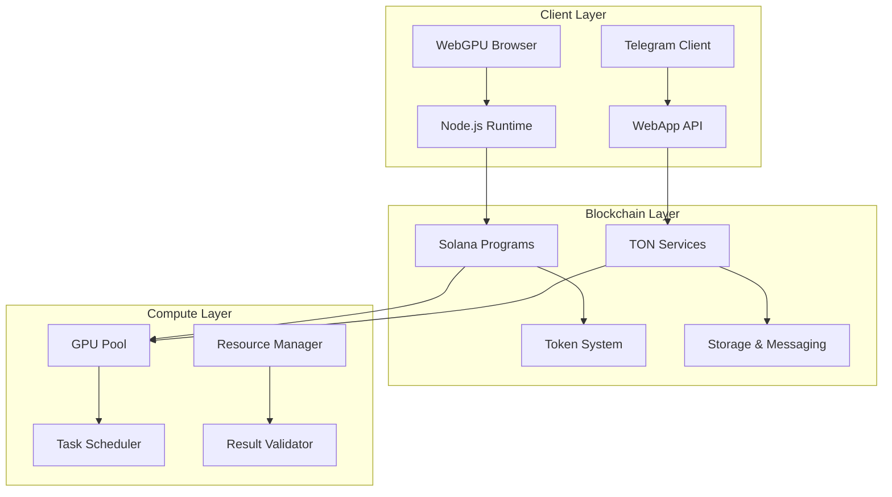
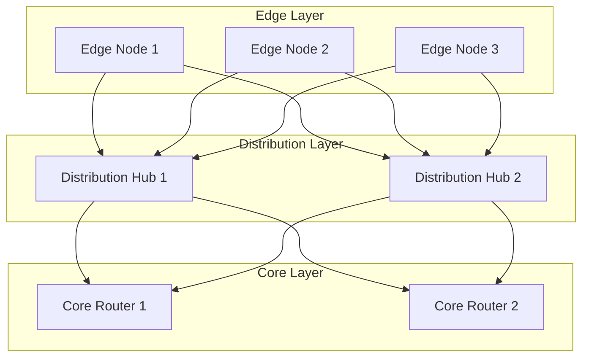
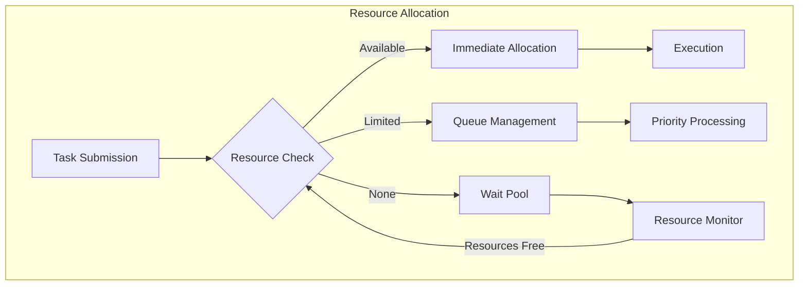
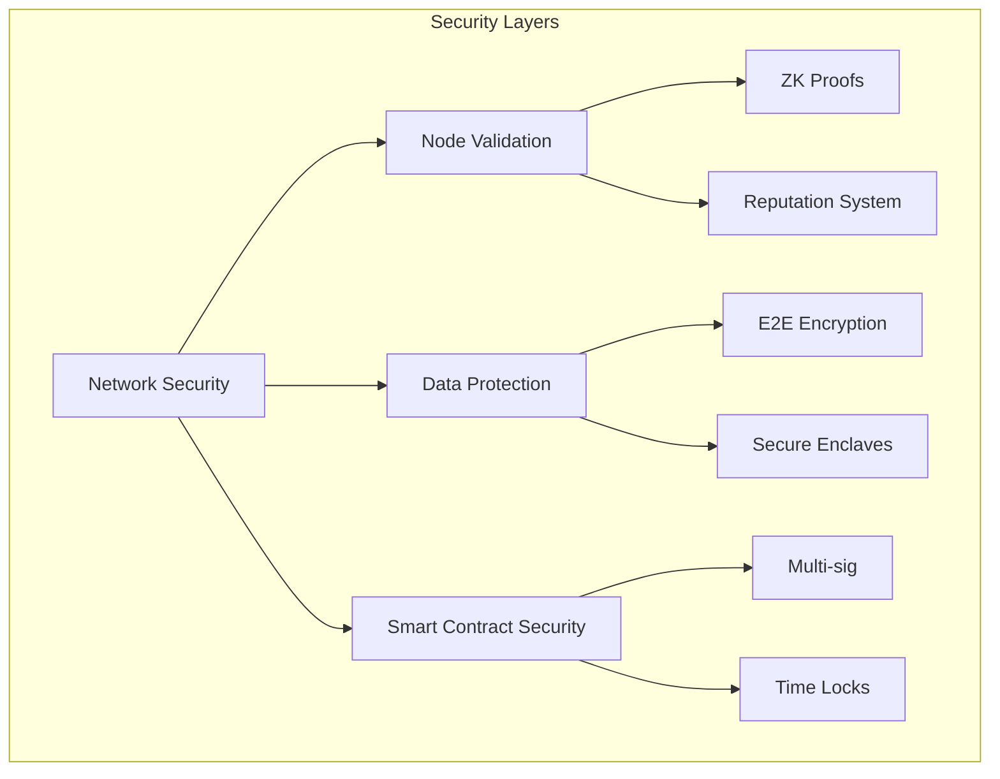

# 1. Abstract

Neurolov implements a novel browser-based distributed computing protocol utilizing WebGPU for direct GPU access, dual-chain architecture (Solana + TON) for efficient compute task distribution, and zero-knowledge proofs for computation verification. Current implementation achieves 85,000 TFLOPS across 170 nodes with 99.99% uptime.

## Core Technical Metrics:
- Compute Throughput: 85,000 TFLOPS
- Average Latency: 50ms
- Network Efficiency: 78%
- Node Validation Time: <2s
- Task Distribution Overhead: <100ms

# 2. System Architecture

## 2.1 High-Level Architecture



## 2.2 WebGPU Implementation

```typescript
class WebGPUManager {
  private device: GPUDevice;
  private queue: GPUQueue;
  private computePipelines: Map<string, GPUComputePipeline>;

  async initialize(): Promise<void> {
    const adapter = await navigator.gpu?.requestAdapter();
    if (!adapter) throw new Error('WebGPU not supported');
    
    this.device = await adapter.requestDevice({
      requiredFeatures: ['timestamp-query', 'pipeline-statistics-query'],
      requiredLimits: {
        maxComputeWorkgroupStorageSize: 32768,
        maxComputeInvocationsPerWorkgroup: 256,
        maxComputeWorkgroupSizeX: 256,
        maxStorageBufferBindingSize: 1024 * 1024 * 1024,
      }
    });
  }

  async createComputePipeline(shaderCode: string, pipelineId: string): Promise<void> {
    const shaderModule = this.device.createShaderModule({
      code: shaderCode,
      hints: {
        layout: 'auto'
      }
    });

    const pipeline = await this.device.createComputePipelineAsync({
      layout: 'auto',
      compute: {
        module: shaderModule,
        entryPoint: 'main',
        constants: {
          WORKGROUP_SIZE: 256
        }
      }
    });

    this.computePipelines.set(pipelineId, pipeline);
  }

  async executeComputation(
    pipelineId: string, 
    inputData: Float32Array
  ): Promise<Float32Array> {
    const pipeline = this.computePipelines.get(pipelineId);
    if (!pipeline) throw new Error('Pipeline not found');

    // Create buffers
    const inputBuffer = this.createBuffer(inputData, GPUBufferUsage.STORAGE);
    const outputBuffer = this.createBuffer(
      new Float32Array(inputData.length), 
      GPUBufferUsage.STORAGE | GPUBufferUsage.COPY_SRC
    );

    // Create bind group
    const bindGroup = this.device.createBindGroup({
      layout: pipeline.getBindGroupLayout(0),
      entries: [
        { binding: 0, resource: { buffer: inputBuffer } },
        { binding: 1, resource: { buffer: outputBuffer } }
      ]
    });

    // Execute computation
    const commandEncoder = this.device.createCommandEncoder();
    const passEncoder = commandEncoder.beginComputePass();
    passEncoder.setPipeline(pipeline);
    passEncoder.setBindGroup(0, bindGroup);
    passEncoder.dispatchWorkgroups(Math.ceil(inputData.length / 256));
    passEncoder.end();

    // Read results
    const resultBuffer = this.device.createBuffer({
      size: outputBuffer.size,
      usage: GPUBufferUsage.COPY_DST | GPUBufferUsage.MAP_READ
    });

    commandEncoder.copyBufferToBuffer(
      outputBuffer, 0,
      resultBuffer, 0,
      resultBuffer.size
    );

    this.queue.submit([commandEncoder.finish()]);

    await resultBuffer.mapAsync(GPUMapMode.READ);
    return new Float32Array(resultBuffer.getMappedRange());
  }
}
```

## 2.3 Blockchain Integration

### Solana Smart Contract for Node Registration

```solidity
#[program]
pub mod neurolov_node_registry {
    use super::*;

    pub fn register_node(
        ctx: Context<RegisterNode>,
        node_info: NodeInfo,
        proof: Vec<u8>
    ) -> Result<()> {
        // Verify zero-knowledge proof of device capabilities
        require!(verify_node_proof(&proof, &node_info), ErrorCode::InvalidProof);

        let node_account = &mut ctx.accounts.node_account;
        node_account.owner = ctx.accounts.owner.key();
        node_account.capabilities = node_info.capabilities;
        node_account.reputation = 0;
        node_account.total_compute = 0;
        node_account.successful_tasks = 0;
        node_account.stake_amount = ctx.accounts.stake_account.amount;

        emit!(NodeRegistered {
            node_id: node_account.key(),
            capabilities: node_info.capabilities,
            timestamp: Clock::get()?.unix_timestamp
        });

        Ok(())
    }
}

#[derive(Accounts)]
pub struct RegisterNode<'info> {
    #[account(init, payer = owner, space = 8 + NodeAccount::SPACE)]
    pub node_account: Account<'info, NodeAccount>,
    #[account(mut)]
    pub owner: Signer<'info>,
    #[account(
        constraint = stake_account.mint == NLOV_MINT_PUBKEY,
        constraint = stake_account.amount >= MIN_STAKE_AMOUNT
    )]
    pub stake_account: Account<'info, TokenAccount>,
    pub system_program: Program<'info, System>,
}
```

## 2.4 Network Topology



## 2.5 Performance Optimization

The system employs a sophisticated performance model based on multiple factors:

$$P_{total} = \sum_{i=1}^{n} (G_i \cdot E_i \cdot \frac{1}{1 + L_i/C_i})$$

Where:
- $G_i$ = Individual GPU performance
- $E_i$ = Node efficiency factor
- $L_i$ = Network latency
- $C_i$ = Computation time
- $n$ = Number of active nodes

Task allocation prioritization uses a weighted scoring system:

$$Score = w_1R + w_2P + w_3S + w_4L$$

Where:
- $R$ = Node reputation score (0-1)
- $P$ = Performance metric (TFLOPS)
- $S$ = Stake amount
- $L$ = Latency factor
- $w_1,w_2,w_3,w_4$ = Weight coefficients

# 3. Core Technical Components

## 3.1 Resource Management System



### Resource Allocation Algorithm

```typescript
interface ResourceRequirements {
  minGPUMemory: number;
  computePower: number;
  expectedDuration: number;
  priority: number;
}

class ResourceAllocator {
  private nodes: Map<string, NodeStatus>;
  private taskQueue: PriorityQueue<ComputeTask>;
  
  async allocateResources(task: ComputeTask): Promise<AllocationResult> {
    const requirements = this.analyzeRequirements(task);
    const availableNodes = await this.findEligibleNodes(requirements);
    
    if (availableNodes.length === 0) {
      return this.handleResourceScarcity(task);
    }
    
    const allocation = this.optimizeAllocation(availableNodes, requirements);
    await this.validateAndReserve(allocation);
    
    return this.finalizeAllocation(allocation);
  }

  private calculateNodeScore(node: NodeStatus, requirements: ResourceRequirements): number {
    const performanceScore = this.calculatePerformanceScore(node, requirements);
    const reliabilityScore = this.calculateReliabilityScore(node);
    const costScore = this.calculateCostEfficiencyScore(node);
    const latencyScore = this.calculateLatencyScore(node);
    
    return performanceScore * 0.4 + 
           reliabilityScore * 0.3 + 
           costScore * 0.2 + 
           latencyScore * 0.1;
  }
}
```

## 3.2 TON Network Integration

### Task Distribution System

```typescript
interface TONTaskDistribution {
  async distributeTask(task: ComputeTask): Promise<TaskDistributionResult> {
    // Create TON message for task distribution
    const message = await this.createTaskMessage(task);
    
    // Find optimal routing path
    const routingPath = await this.calculateOptimalRoute(task.requirements);
    
    // Distribute via TON network
    const distribution = await this.ton.sendMessage({
      to: routingPath.targetWorkchain,
      value: task.bounty,
      payload: message,
      route: routingPath
    });
    
    return this.monitorDistribution(distribution.id);
  }
}
```

### Cross-Chain Message Protocol

```solidity
contract CrossChainBridge {
    struct MessagePayload {
        bytes32 taskId;
        address sourceChain;
        address targetChain;
        uint256 value;
        bytes data;
    }
    
    function sendCrossChainMessage(
        MessagePayload memory payload
    ) external payable {
        require(msg.value >= calculateFee(payload), "Insufficient fee");
        
        bytes memory message = abi.encode(
            payload.taskId,
            payload.sourceChain,
            payload.targetChain,
            payload.value,
            payload.data
        );
        
        emit MessageSent(payload.taskId, message);
        _processCrossChainTransfer(payload);
    }
}
```

### TON Storage Implementation

```typescript
class TONStorageManager {
  async storeData(data: Uint8Array): Promise<StorageReceipt> {
    // Split data into chunks for distributed storage
    const chunks = this.splitIntoChunks(data);
    
    // Calculate Reed-Solomon encoding for redundancy
    const encodedChunks = this.encodeWithRedundancy(chunks);
    
    // Distribute across TON storage network
    const storagePromises = encodedChunks.map(chunk => 
      this.ton.storage.store(chunk, {
        redundancy: 3,
        encryption: 'aes-256-gcm',
        access: {
          public: false,
          allowedUsers: [task.owner]
        }
      })
    );
    
    const results = await Promise.all(storagePromises);
    return this.createStorageReceipt(results);
  }
}
```

## 3.3 Proof of Computation System

### Mathematical Model

The Proof of Computation (PoC) system uses a zero-knowledge proof construction:

$$\pi = Proof\{(x, w): C(x, w) = 1\}$$

Where:
- $x$ is the public input (task specification)
- $w$ is the witness (computation results)
- $C$ is the verification circuit

The verification equation:

$$e(g^{\alpha}, h^{\beta}) \cdot e(g^x, h^w) = e(g^{\pi}, h)$$

Implementation in code:

```typescript
class ProofOfComputation {
  async generateProof(
    task: ComputeTask, 
    result: ComputeResult
  ): Promise<ZKProof> {
    const circuit = await this.buildCircuit(task.specification);
    const witness = this.prepareWitness(result);
    
    // Generate zero-knowledge proof
    const proof = await snarkjs.groth16.prove(circuit, witness);
    
    // Verify proof locally before submission
    const verified = await this.verifyProof(proof, task.publicInputs);
    if (!verified) throw new Error('Proof generation failed');
    
    return {
      proof,
      publicInputs: task.publicInputs,
      taskId: task.id
    };
  }
}
```

# 4. Security Architecture

## 4.1 Multi-Layer Security Model



### Node Validation Protocol

```typescript
class NodeValidator {
  async validateNode(
    nodeId: string, 
    capabilities: NodeCapabilities
  ): Promise<ValidationResult> {
    // Hardware validation through WebGPU
    const gpuValidation = await this.validateGPUCapabilities(capabilities.gpu);
    
    // Network performance verification
    const networkMetrics = await this.measureNetworkPerformance(nodeId);
    
    // Proof of stake verification
    const stakeVerification = await this.verifyStake(nodeId);
    
    // Generate zero-knowledge proof of capabilities
    const zkProof = await this.generateCapabilityProof({
      gpuValidation,
      networkMetrics,
      stakeVerification
    });
    
    return {
      isValid: this.checkAllValidations([
        gpuValidation,
        networkMetrics,
        stakeVerification
      ]),
      proof: zkProof,
      metrics: {
        performance: gpuValidation.metrics,
        network: networkMetrics,
        stake: stakeVerification.amount
      }
    };
  }
}
```

## 4.2 Security Protocol Specifications

### Encryption Protocol

```typescript
interface EncryptionProtocol {
  // Key derivation function
  kdf(secret: Uint8Array, salt: Uint8Array): Promise<CryptoKey> {
    return crypto.subtle.deriveKey(
      {
        name: 'PBKDF2',
        salt: salt,
        iterations: 100000,
        hash: 'SHA-256'
      },
      secret,
      { name: 'AES-GCM', length: 256 },
      false,
      ['encrypt', 'decrypt']
    );
  }

  // Task data encryption
  async encryptTaskData(
    data: Uint8Array, 
    nodePublicKey: CryptoKey
  ): Promise<EncryptedData> {
    const iv = crypto.getRandomValues(new Uint8Array(12));
    const encryptionKey = await this.kdf(
      await crypto.subtle.exportKey('raw', nodePublicKey),
      iv
    );
    
    const encryptedData = await crypto.subtle.encrypt(
      { name: 'AES-GCM', iv },
      encryptionKey,
      data
    );
    
    return {
      data: new Uint8Array(encryptedData),
      iv,
      ephemeralPublicKey: await this.generateEphemeralKey()
    };
  }
}
```

# 5. Performance Metrics & Benchmarking

## 5.1 System Performance Model

The system's overall performance is modeled using the following equations:

### Network Performance
$$T_{network} = \sum_{i=1}^{n} \frac{D_i}{B_i} + L_i$$

Where:
- $D_i$ = Data size for node i
- $B_i$ = Available bandwidth
- $L_i$ = Network latency

### Computation Efficiency
$$E_{compute} = \frac{\sum_{i=1}^{n} C_i \cdot U_i}{\sum_{i=1}^{n} C_i}$$

Where:
- $C_i$ = Compute capacity of node i
- $U_i$ = Utilization factor

## 5.2 Benchmark Implementation

```typescript
class PerformanceBenchmark {
  async runBenchmark(): Promise<BenchmarkResults> {
    const results: BenchmarkMetric[] = [];
    
    // Test computation performance
    const computeMetrics = await this.benchmarkCompute({
      iterations: 1000,
      dataSize: [1e6, 1e7, 1e8],
      parallel: true
    });
    
    // Test network performance
    const networkMetrics = await this.benchmarkNetwork({
      packetSize: [1024, 10240, 102400],
      nodes: this.getActiveNodes(),
      protocol: ['tcp', 'udp']
    });
    
    // Test storage performance
    const storageMetrics = await this.benchmarkStorage({
      operations: ['read', 'write', 'delete'],
      dataSize: [1e6, 1e7, 1e8],
      redundancy: [1, 2, 3]
    });
    
    return this.analyzeResults([
      computeMetrics,
      networkMetrics,
      storageMetrics
    ]);
  }
}
```
