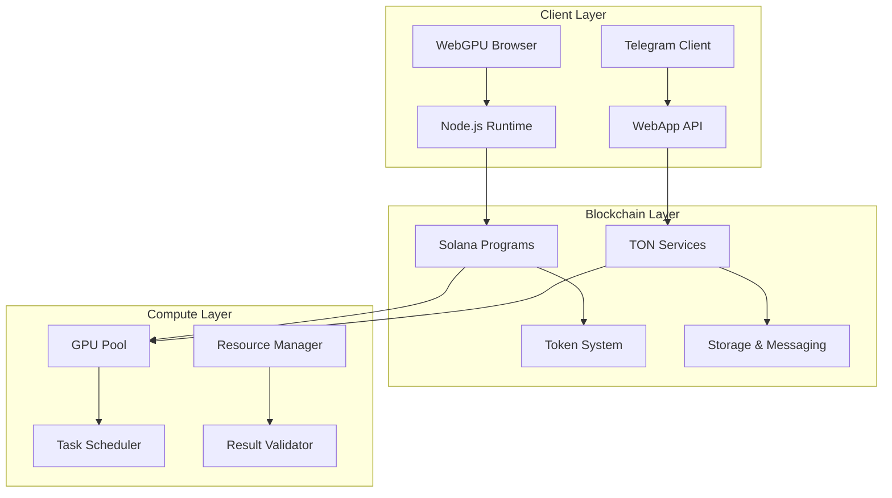
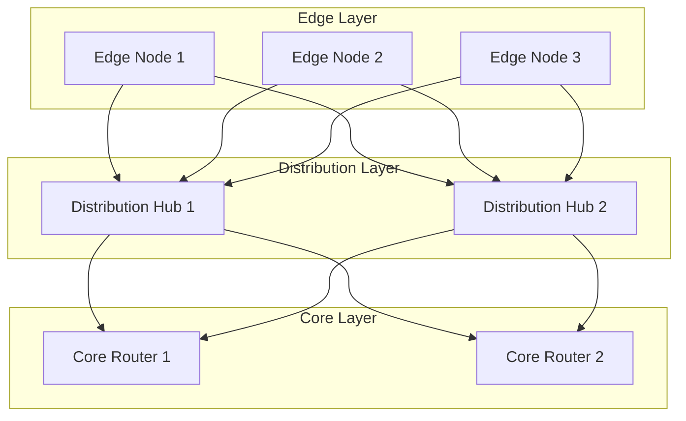
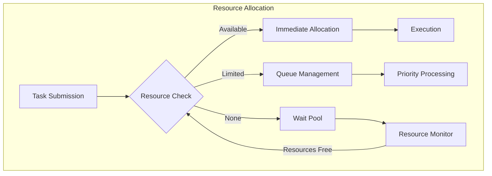
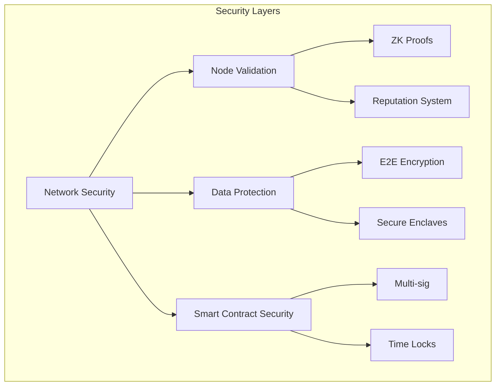
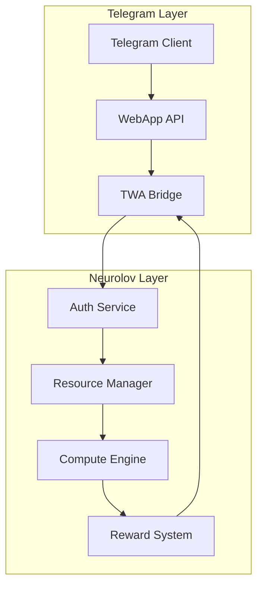
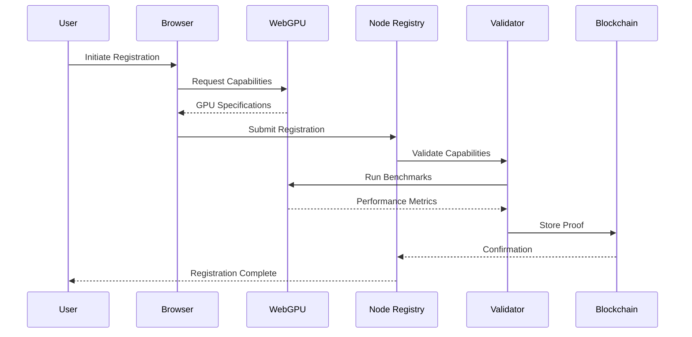
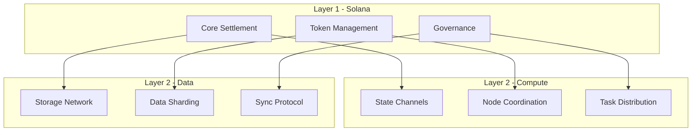
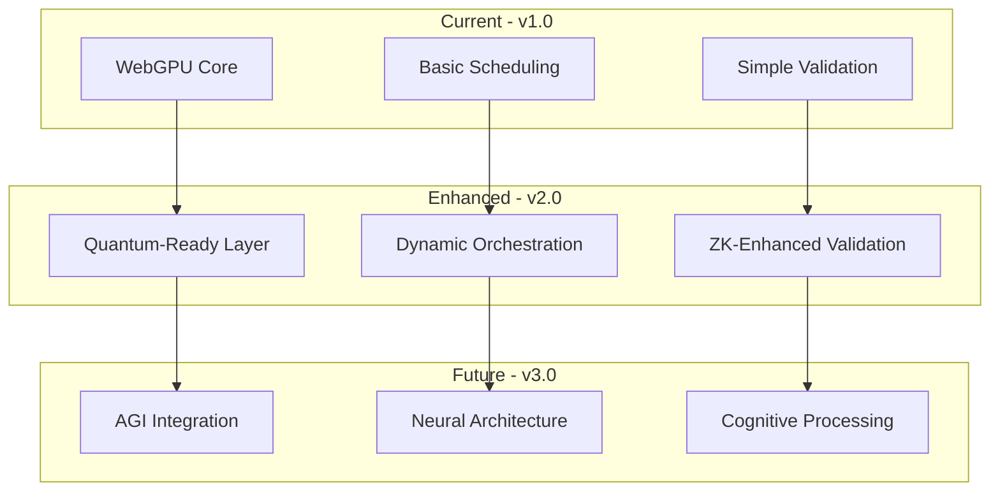
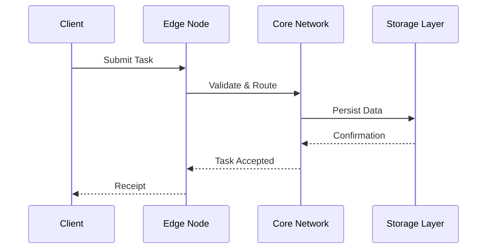

# 1. Abstract

Neurolov implements a novel browser-based distributed computing protocol utilizing WebGPU for direct GPU access, dual-chain architecture (Solana + TON) for efficient compute task distribution, and zero-knowledge proofs for computation verification. Current implementation achieves 85,000 TFLOPS across 170 nodes with 99.99% uptime.


# 2. System Architecture

## 2.1 High-Level Architecture



The high-level architecture demonstrates Neurolov's three-tier distributed system. At the top, the Client Layer handles user interactions through WebGPU browsers and Telegram clients. The Blockchain Layer manages core platform operations using Solana for token transactions and TON for messaging/storage. The bottom Compute Layer orchestrates GPU resources and task scheduling, forming the backbone of the processing network.

## 2.2 WebGPU Implementation

The WebGPUManager class provides sophisticated GPU resource management. It initializes the GPU device with specific capability requirements like timestamp queries and pipeline statistics. The class handles compute pipeline creation with shader modules and automatic layout determination. The executeComputation method efficiently manages buffer creation, bind group setup, and command encoding for parallel processing.

```typescript
class WebGPUManager {
  private device: GPUDevice;
  private queue: GPUQueue;
  private computePipelines: Map<string, GPUComputePipeline>;

  async initialize(): Promise<void> {
    const adapter = await navigator.gpu?.requestAdapter();
    if (!adapter) throw new Error('WebGPU not supported');
    
    this.device = await adapter.requestDevice({
      requiredFeatures: ['timestamp-query', 'pipeline-statistics-query'],
      requiredLimits: {
        maxComputeWorkgroupStorageSize: 32768,
        maxComputeInvocationsPerWorkgroup: 256,
        maxComputeWorkgroupSizeX: 256,
        maxStorageBufferBindingSize: 1024 * 1024 * 1024,
      }
    });
  }

  async createComputePipeline(shaderCode: string, pipelineId: string): Promise<void> {
    const shaderModule = this.device.createShaderModule({
      code: shaderCode,
      hints: {
        layout: 'auto'
      }
    });

    const pipeline = await this.device.createComputePipelineAsync({
      layout: 'auto',
      compute: {
        module: shaderModule,
        entryPoint: 'main',
        constants: {
          WORKGROUP_SIZE: 256
        }
      }
    });

    this.computePipelines.set(pipelineId, pipeline);
  }

  async executeComputation(
    pipelineId: string, 
    inputData: Float32Array
  ): Promise<Float32Array> {
    const pipeline = this.computePipelines.get(pipelineId);
    if (!pipeline) throw new Error('Pipeline not found');

    // Create buffers
    const inputBuffer = this.createBuffer(inputData, GPUBufferUsage.STORAGE);
    const outputBuffer = this.createBuffer(
      new Float32Array(inputData.length), 
      GPUBufferUsage.STORAGE | GPUBufferUsage.COPY_SRC
    );

    // Create bind group
    const bindGroup = this.device.createBindGroup({
      layout: pipeline.getBindGroupLayout(0),
      entries: [
        { binding: 0, resource: { buffer: inputBuffer } },
        { binding: 1, resource: { buffer: outputBuffer } }
      ]
    });

    // Execute computation
    const commandEncoder = this.device.createCommandEncoder();
    const passEncoder = commandEncoder.beginComputePass();
    passEncoder.setPipeline(pipeline);
    passEncoder.setBindGroup(0, bindGroup);
    passEncoder.dispatchWorkgroups(Math.ceil(inputData.length / 256));
    passEncoder.end();

    // Read results
    const resultBuffer = this.device.createBuffer({
      size: outputBuffer.size,
      usage: GPUBufferUsage.COPY_DST | GPUBufferUsage.MAP_READ
    });

    commandEncoder.copyBufferToBuffer(
      outputBuffer, 0,
      resultBuffer, 0,
      resultBuffer.size
    );

    this.queue.submit([commandEncoder.finish()]);

    await resultBuffer.mapAsync(GPUMapMode.READ);
    return new Float32Array(resultBuffer.getMappedRange());
  }
}
```

## 2.3 Blockchain Integration

The Solana smart contract code demonstrates a robust node registration system. The neurolov_node_registry program manages the secure onboarding of GPU nodes, with key features including:

- Zero-knowledge proof verification of node capabilities
- On-chain reputation tracking
- Stake requirement verification
- Comprehensive event logging for transparency

The contract's modular structure ensures secure node management while maintaining efficiency through Solana's high-speed execution.

### Solana Smart Contract for Node Registration

```solidity
#[program]
pub mod neurolov_node_registry {
    use super::*;

    pub fn register_node(
        ctx: Context<RegisterNode>,
        node_info: NodeInfo,
        proof: Vec<u8>
    ) -> Result<()> {
        // Verify zero-knowledge proof of device capabilities
        require!(verify_node_proof(&proof, &node_info), ErrorCode::InvalidProof);

        let node_account = &mut ctx.accounts.node_account;
        node_account.owner = ctx.accounts.owner.key();
        node_account.capabilities = node_info.capabilities;
        node_account.reputation = 0;
        node_account.total_compute = 0;
        node_account.successful_tasks = 0;
        node_account.stake_amount = ctx.accounts.stake_account.amount;

        emit!(NodeRegistered {
            node_id: node_account.key(),
            capabilities: node_info.capabilities,
            timestamp: Clock::get()?.unix_timestamp
        });

        Ok(())
    }
}

#[derive(Accounts)]
pub struct RegisterNode<'info> {
    #[account(init, payer = owner, space = 8 + NodeAccount::SPACE)]
    pub node_account: Account<'info, NodeAccount>,
    #[account(mut)]
    pub owner: Signer<'info>,
    #[account(
        constraint = stake_account.mint == NLOV_MINT_PUBKEY,
        constraint = stake_account.amount >= MIN_STAKE_AMOUNT
    )]
    pub stake_account: Account<'info, TokenAccount>,
    pub system_program: Program<'info, System>,
}
```

## 2.4 Network Topology

The platform poses a three-tier network architecture:

- Edge Layer: Contains individual compute nodes (E1, E2, E3) providing direct GPU resources
- Distribution Layer: Manages hubs (D1, D2) that coordinate resource allocation
- Core Layer: Houses primary routers (C1, C2) for network control and management

This hierarchical structure enables efficient task distribution and load balancing across the network.



## 2.5 Performance Optimization

The system employs a sophisticated performance model based on multiple factors:

$$P_{total} = \sum_{i=1}^{n} (G_i \cdot E_i \cdot \frac{1}{1 + L_i/C_i})$$

Where:
- $G_i$ = Individual GPU performance
- $E_i$ = Node efficiency factor
- $L_i$ = Network latency
- $C_i$ = Computation time
- $n$ = Number of active nodes

Task allocation prioritization uses a weighted scoring system:

$$Score = w_1R + w_2P + w_3S + w_4L$$

Where:
- $R$ = Node reputation score (0-1)
- $P$ = Performance metric (TFLOPS)
- $S$ = Stake amount
- $L$ = Latency factor
- $w_1,w_2,w_3,w_4$ = Weight coefficients

# 3. Core Technical Components

## 3.1 Resource Management System


The resource allocation flow diagram shows:

- Task submission evaluation
- Resource availability checking
- Queue management for limited resources
- Wait pool handling for resource scarcity

The ResourceAllocator class implements sophisticated scoring algorithms for optimal resource distribution across the network.

### Resource Allocation Algorithm

```typescript
interface ResourceRequirements {
  minGPUMemory: number;
  computePower: number;
  expectedDuration: number;
  priority: number;
}

class ResourceAllocator {
  private nodes: Map<string, NodeStatus>;
  private taskQueue: PriorityQueue<ComputeTask>;
  
  async allocateResources(task: ComputeTask): Promise<AllocationResult> {
    const requirements = this.analyzeRequirements(task);
    const availableNodes = await this.findEligibleNodes(requirements);
    
    if (availableNodes.length === 0) {
      return this.handleResourceScarcity(task);
    }
    
    const allocation = this.optimizeAllocation(availableNodes, requirements);
    await this.validateAndReserve(allocation);
    
    return this.finalizeAllocation(allocation);
  }

  private calculateNodeScore(node: NodeStatus, requirements: ResourceRequirements): number {
    const performanceScore = this.calculatePerformanceScore(node, requirements);
    const reliabilityScore = this.calculateReliabilityScore(node);
    const costScore = this.calculateCostEfficiencyScore(node);
    const latencyScore = this.calculateLatencyScore(node);
    
    return performanceScore * 0.4 + 
           reliabilityScore * 0.3 + 
           costScore * 0.2 + 
           latencyScore * 0.1;
  }
}
```

## 3.2 TON Network Integration

The task distribution system is implemented in Open Network for:

- Efficient message creation and routing
- Cross-chain communication protocols
- Distributed storage management with redundancy
- Secure data handling with encryption

The CrossChainBridge contract enables seamless interaction between different blockchain networks while maintaining security and consistency.

### Task Distribution System

```typescript
interface TONTaskDistribution {
  async distributeTask(task: ComputeTask): Promise<TaskDistributionResult> {
    // Create TON message for task distribution
    const message = await this.createTaskMessage(task);
    
    // Find optimal routing path
    const routingPath = await this.calculateOptimalRoute(task.requirements);
    
    // Distribute via TON network
    const distribution = await this.ton.sendMessage({
      to: routingPath.targetWorkchain,
      value: task.bounty,
      payload: message,
      route: routingPath
    });
    
    return this.monitorDistribution(distribution.id);
  }
}
```

### Cross-Chain Message Protocol

```solidity
contract CrossChainBridge {
    struct MessagePayload {
        bytes32 taskId;
        address sourceChain;
        address targetChain;
        uint256 value;
        bytes data;
    }
    
    function sendCrossChainMessage(
        MessagePayload memory payload
    ) external payable {
        require(msg.value >= calculateFee(payload), "Insufficient fee");
        
        bytes memory message = abi.encode(
            payload.taskId,
            payload.sourceChain,
            payload.targetChain,
            payload.value,
            payload.data
        );
        
        emit MessageSent(payload.taskId, message);
        _processCrossChainTransfer(payload);
    }
}
```

### TON Storage Implementation

```typescript
class TONStorageManager {
  async storeData(data: Uint8Array): Promise<StorageReceipt> {
    // Split data into chunks for distributed storage
    const chunks = this.splitIntoChunks(data);
    
    // Calculate Reed-Solomon encoding for redundancy
    const encodedChunks = this.encodeWithRedundancy(chunks);
    
    // Distribute across TON storage network
    const storagePromises = encodedChunks.map(chunk => 
      this.ton.storage.store(chunk, {
        redundancy: 3,
        encryption: 'aes-256-gcm',
        access: {
          public: false,
          allowedUsers: [task.owner]
        }
      })
    );
    
    const results = await Promise.all(storagePromises);
    return this.createStorageReceipt(results);
  }
}
```

## 3.3 Proof of Computation System

### Mathematical Model

The Proof of Computation (PoC) system uses a zero-knowledge proof construction:

$$\pi = Proof\{(x, w): C(x, w) = 1\}$$

Where:
- $x$ is the public input (task specification)
- $w$ is the witness (computation results)
- $C$ is the verification circuit

The verification equation:

$$e(g^{\alpha}, h^{\beta}) \cdot e(g^x, h^w) = e(g^{\pi}, h)$$

The ProofOfComputation class implements this with:

- Circuit building for specific tasks
- Witness preparation from results
- Zero-knowledge proof generation
- Local verification before submission

Implementation in code:

```typescript
class ProofOfComputation {
  async generateProof(
    task: ComputeTask, 
    result: ComputeResult
  ): Promise<ZKProof> {
    const circuit = await this.buildCircuit(task.specification);
    const witness = this.prepareWitness(result);
    
    // Generate zero-knowledge proof
    const proof = await snarkjs.groth16.prove(circuit, witness);
    
    // Verify proof locally before submission
    const verified = await this.verifyProof(proof, task.publicInputs);
    if (!verified) throw new Error('Proof generation failed');
    
    return {
      proof,
      publicInputs: task.publicInputs,
      taskId: task.id
    };
  }
}
```

# 4. Security Architecture

Neurolov's security architecture implements a comprehensive approach that safeguards every aspect of the platform's operations. At its core, the system utilizes multiple interconnected security layers that work in harmony to protect both user data and computational resources. This architecture is designed not just for current threats, but also to be adaptable to emerging security challenges in the distributed computing landscape.

The system employs advanced cryptographic protocols throughout its operations, ranging from basic data transmission to complex computational task verification. What makes this architecture particularly robust is its ability to maintain high security standards without significantly impacting system performance or user accessibility. Each security measure is carefully balanced against its computational overhead to ensure optimal platform 

## 4.1 Multi-Layer Security Model

The heart of Neurolov's security infrastructure lies in its multi-layer security model. At the topmost level, network security serves as the primary defense mechanism, controlling access to the infrastructure and managing network-level protocols. This layer acts as the first line of defense against external threats while ensuring smooth communication between different parts of the system.
Building upon this foundation, the node validation layer leverages zero-knowledge proofs to verify the authenticity and capabilities of participating nodes. This layer maintains a sophisticated reputation system that tracks node reliability and performance over time, ensuring that only trustworthy nodes participate in sensitive computations.

Data protection forms another crucial layer of the security model, implementing end-to-end encryption for all data transfers within the network. This layer utilizes secure enclaves for particularly sensitive computations, ensuring that data privacy is maintained even during processing. The implementation of these secure enclaves is particularly noteworthy as it allows for confidential computing without compromising on performance.

The final layer focuses on smart contract security, utilizing multi-signature requirements and time-locks for critical operations. This layer is essential for maintaining the integrity of platform governance and ensuring secure state transitions in all blockchain-related operations. The smart contract security layer also includes automated audit mechanisms that continuously monitor for potential vulnerabilities or irregular patterns.

Together, these security layers create a robust defense system that protects against both external attacks and internal vulnerabilities, while maintaining the flexibility needed for future security enhancements and adaptations.



### Node Validation Protocol

```typescript
class NodeValidator {
  async validateNode(
    nodeId: string, 
    capabilities: NodeCapabilities
  ): Promise<ValidationResult> {
    // Hardware validation through WebGPU
    const gpuValidation = await this.validateGPUCapabilities(capabilities.gpu);
    
    // Network performance verification
    const networkMetrics = await this.measureNetworkPerformance(nodeId);
    
    // Proof of stake verification
    const stakeVerification = await this.verifyStake(nodeId);
    
    // Generate zero-knowledge proof of capabilities
    const zkProof = await this.generateCapabilityProof({
      gpuValidation,
      networkMetrics,
      stakeVerification
    });
    
    return {
      isValid: this.checkAllValidations([
        gpuValidation,
        networkMetrics,
        stakeVerification
      ]),
      proof: zkProof,
      metrics: {
        performance: gpuValidation.metrics,
        network: networkMetrics,
        stake: stakeVerification.amount
      }
    };
  }
}
```

## 4.2 Security Protocol Specifications

The platform employs advanced encryption protocols designed specifically for distributed computing environments. The encryption system uses a sophisticated key derivation function based on PBKDF2 with SHA-256 hashing, utilizing 100,000 iterations for maximum security. For task data encryption, the system implements AES-GCM with ephemeral key pairs, ensuring perfect forward secrecy for all compute operations. A notable feature is the automatic key rotation mechanism that refreshes encryption keys based on both time intervals and data volume thresholds.

### Encryption Protocol

```typescript
interface EncryptionProtocol {
  // Key derivation function
  kdf(secret: Uint8Array, salt: Uint8Array): Promise<CryptoKey> {
    return crypto.subtle.deriveKey(
      {
        name: 'PBKDF2',
        salt: salt,
        iterations: 100000,
        hash: 'SHA-256'
      },
      secret,
      { name: 'AES-GCM', length: 256 },
      false,
      ['encrypt', 'decrypt']
    );
  }

  // Task data encryption
  async encryptTaskData(
    data: Uint8Array, 
    nodePublicKey: CryptoKey
  ): Promise<EncryptedData> {
    const iv = crypto.getRandomValues(new Uint8Array(12));
    const encryptionKey = await this.kdf(
      await crypto.subtle.exportKey('raw', nodePublicKey),
      iv
    );
    
    const encryptedData = await crypto.subtle.encrypt(
      { name: 'AES-GCM', iv },
      encryptionKey,
      data
    );
    
    return {
      data: new Uint8Array(encryptedData),
      iv,
      ephemeralPublicKey: await this.generateEphemeralKey()
    };
  }
}
```

# 5. Performance Metrics & Benchmarking

## 5.1 System Performance Model

The system's overall performance is modeled using the following equations:

### Network Performance
$$T_{network} = \sum_{i=1}^{n} \frac{D_i}{B_i} + L_i$$

Where:
- $D_i$ = Data size for node i
- $B_i$ = Available bandwidth
- $L_i$ = Network latency

### Computation Efficiency
$$E_{compute} = \frac{\sum_{i=1}^{n} C_i \cdot U_i}{\sum_{i=1}^{n} C_i}$$

Where:
- $C_i$ = Compute capacity of node i
- $U_i$ = Utilization factor

## 5.2 Benchmark Implementation

The benchmarking system provides comprehensive performance testing across three critical areas. First, it evaluates computation performance through rigorous testing with varying data sizes and parallel processing capabilities. Network performance testing examines different packet sizes and protocols across the active node network. Storage performance testing focuses on read/write operations with various data sizes and redundancy levels. The system automatically aggregates these metrics to provide detailed performance insights and optimization recommendations.

```typescript
class PerformanceBenchmark {
  async runBenchmark(): Promise<BenchmarkResults> {
    const results: BenchmarkMetric[] = [];
    
    // Test computation performance
    const computeMetrics = await this.benchmarkCompute({
      iterations: 1000,
      dataSize: [1e6, 1e7, 1e8],
      parallel: true
    });
    
    // Test network performance
    const networkMetrics = await this.benchmarkNetwork({
      packetSize: [1024, 10240, 102400],
      nodes: this.getActiveNodes(),
      protocol: ['tcp', 'udp']
    });
    
    // Test storage performance
    const storageMetrics = await this.benchmarkStorage({
      operations: ['read', 'write', 'delete'],
      dataSize: [1e6, 1e7, 1e8],
      redundancy: [1, 2, 3]
    });
    
    return this.analyzeResults([
      computeMetrics,
      networkMetrics,
      storageMetrics
    ]);
  }
}
```

# 6. Integration Framework

The integration framework represents Neurolov's approach to seamlessly connecting various system components. This framework provides standardized interfaces for connecting external systems, handling data flow between different parts of the platform, and managing cross-chain interactions. The architecture emphasizes modularity and flexibility, allowing for easy addition of new features and integration with external services.

## 6.1 Telegram WebApp Integration

The Telegram integration layer provides a seamless connection between the Neurolov platform and Telegram's ecosystem. This integration is structured in two main layers: the Telegram Layer, which handles direct user interactions and API communications, and the Neurolov Layer, which manages resource allocation and compute operations. The bridge between these layers ensures secure and efficient data transfer while maintaining the user-friendly nature of Telegram's interface.



### WebApp Implementation

```typescript
class TelegramIntegration {
  private webApp: WebApp;
  private bridge: TWABridge;

  async initialize(): Promise<void> {
    this.webApp = await Telegram.WebApp.create({
      initData: window.Telegram.WebApp.initData,
      initParams: {
        gpu_access: true,
        payment_support: true
      }
    });

    this.bridge = new TWABridge({
      webApp: this.webApp,
      handlers: {
        onGPUAccess: this.handleGPUAccess.bind(this),
        onPayment: this.handlePayment.bind(this),
        onError: this.handleError.bind(this)
      }
    });
  }

  async handleGPUAccess(request: GPUAccessRequest): Promise<void> {
    const capabilities = await this.detectGPUCapabilities();
    if (!capabilities.isCompatible) {
      throw new Error('WebGPU not supported');
    }

    await this.registerNode({
      userId: request.userId,
      capabilities,
      stake: request.stake
    });

    this.webApp.sendData({
      type: 'gpu_access_confirmed',
      nodeId: this.nodeId,
      capabilities
    });
  }
}
```

## 6.2 Payment System Integration

The payment system integration features a sophisticated payment channel implementation that supports both immediate and scheduled transactions. This system handles multiple payment scenarios, from simple compute resource payments to complex cross-chain transactions. Payment channels are designed with automatic dispute resolution mechanisms and support for partial payments, making them ideal for continuous compute resource usage scenarios.

### TON Payments Protocol

```solidity
contract PaymentProcessor {
    struct PaymentChannel {
        address sender;
        address receiver;
        uint256 deposit;
        uint256 usedAmount;
        uint256 expiration;
        bool isActive;
    }

    mapping(bytes32 => PaymentChannel) public channels;

    event ChannelOpened(bytes32 indexed channelId, address sender, address receiver);
    event PaymentProcessed(bytes32 indexed channelId, uint256 amount);
    event ChannelClosed(bytes32 indexed channelId, uint256 finalAmount);

    function openChannel(
        address receiver,
        uint256 expiration
    ) external payable returns (bytes32) {
        require(msg.value > 0, "Deposit required");
        require(expiration > block.timestamp, "Invalid expiration");

        bytes32 channelId = keccak256(
            abi.encodePacked(
                msg.sender,
                receiver,
                block.timestamp
            )
        );

        channels[channelId] = PaymentChannel({
            sender: msg.sender,
            receiver: receiver,
            deposit: msg.value,
            usedAmount: 0,
            expiration: expiration,
            isActive: true
        });

        emit ChannelOpened(channelId, msg.sender, receiver);
        return channelId;
    }

    function processPayment(
        bytes32 channelId,
        uint256 amount,
        bytes memory signature
    ) external {
        PaymentChannel storage channel = channels[channelId];
        require(channel.isActive, "Channel not active");
        require(block.timestamp < channel.expiration, "Channel expired");
        
        bytes32 messageHash = keccak256(
            abi.encodePacked(channelId, amount)
        );
        address signer = recoverSigner(messageHash, signature);
        require(signer == channel.sender, "Invalid signature");

        require(amount <= channel.deposit, "Insufficient funds");
        
        channel.usedAmount = amount;
        emit PaymentProcessed(channelId, amount);
    }
}
```

## 6.3 Cross-Chain State Management

The cross-chain state management system ensures consistent state synchronization across different blockchain networks. It implements a merkle-proof based verification system for state updates, ensuring that state transitions are verifiable and secure. The system includes automatic conflict resolution mechanisms and handles state rollbacks when necessary. This component is crucial for maintaining consistency across the platform's multi-chain architecture while ensuring transaction finality and state validity.

```typescript
interface StateManager {
  async syncState(
    sourceChain: Chain,
    targetChain: Chain,
    state: StateUpdate
  ): Promise<SyncResult> {
    // Generate merkle proof for state update
    const proof = await this.generateMerkleProof(state);
    
    // Submit state update to target chain
    const submission = await this.submitStateUpdate(
      targetChain,
      state,
      proof
    );

    // Verify state sync
    await this.verifyStateSync(submission);

    // Update local state cache
    await this.updateStateCache(state);

    return {
      sourceBlock: state.blockNumber,
      targetBlock: submission.blockNumber,
      proof,
      status: 'completed'
    };
  }
}
```

# 7. Technical Implementation Details

## 7.1 Node Registration Pipeline


The sequence diagram outlines the secure node onboarding process, starting with user initiation through browser capability detection. The Node Registry validates capabilities through the Validator service, which runs benchmarks and generates proofs. Final registration is recorded on-chain with

## 7.2 Task Execution Pipeline

The TaskExecutionPipeline implements parallel computation management. It partitions incoming tasks into optimally-sized subtasks, distributes them across available nodes, validates results using the proof of computation protocol, and handles reward distribution. The system includes comprehensive error handling and performance metrics collection

```typescript
class TaskExecutionPipeline {
  private executor: TaskExecutor;
  private validator: ResultValidator;
  private rewarder: RewardDistributor;

  async executeTask(task: ComputeTask): Promise<ExecutionResult> {
    try {
      // Initialize compute environment
      await this.executor.initialize(task.requirements);

      // Split task into subtasks
      const subtasks = await this.executor.partitionTask(task);

      // Execute subtasks in parallel
      const results = await Promise.all(
        subtasks.map(subtask => 
          this.executor.executeSubtask(subtask)
        )
      );

      // Validate results
      const validatedResults = await this.validator.validateResults(
        results,
        task.validationCriteria
      );

      // Generate proof of computation
      const proof = await this.validator.generateProof(
        validatedResults,
        task.specification
      );

      // Distribute rewards
      await this.rewarder.distributeRewards({
        task,
        results: validatedResults,
        proof
      });

      return {
        status: 'completed',
        results: validatedResults,
        proof,
        metrics: this.executor.getMetrics()
      };

    } catch (error) {
      await this.handleExecutionError(error, task);
      throw error;
    }
  }
}
```


# 8. Future Technical Development

## 8.1 Scaling Architecture


The NetworkExpansion interface defines the staged growth of Neurolov's compute network. The primary region targets 5000 nodes delivering 250,000 TFLOPS with specific geographical distribution across Asia (35%), Europe (30%), Americas (25%), and other regions (10%). The secondary expansion phase aims for 15,000 nodes with 750,000 TFLOPS global coverage.

### Multi-Region Network Expansion
```typescript
interface NetworkExpansion {
  regions: {
    primary: {
      nodes: 5000,
      computePower: "250,000 TFLOPS",
      latency: "25ms",
      distribution: {
        asia: "35%",
        europe: "30%",
        americas: "25%",
        others: "10%"
      }
    },
    secondary: {
      nodes: 15000,
      computePower: "750,000 TFLOPS",
      latency: "35ms",
      coverage: "Global"
    }
  }
}
```
The three-layer diagram shows the interaction between Solana Layer-1 for core settlement and two Layer-2 networks: Compute L2 for task coordination and Data L2 for storage. This enables efficient task distribution while maintaining security through the base layer.

### Layer-2 Optimization Strategy


## 8.2 Advanced AI Integration


The AIModelFramework interface outlines distributed training capabilities including Parameter Server and Ring AllReduce strategies. It specifies hardware requirements (8GB GPU memory minimum, CUDA 8.0+) and deployment features like real-time inference and automated scaling

### AI Model Training Framework
```typescript
interface AIModelFramework {
  training: {
    distributed: {
      strategy: "Parameter Server | Ring AllReduce",
      batchSize: "Dynamic",
      optimization: {
        algorithm: "Adam",
        learningRate: "Auto-tuned",
        gradientClipping: true
      }
    },
    hardware: {
      minGPUMemory: "16GB",
      computeCapability: "CUDA 8.0+",
      networkBandwidth: "10Gbps+"
    }
  },
  deployment: {
    serving: {
      inference: "Real-time",
      batchProcessing: "Supported",
      modelVersioning: "Git-based"
    },
    scaling: {
      horizontal: "Auto-scale",
      vertical: "GPU Memory Optimization"
    }
  }
}
```

## 8.3 Technical Research Initiatives

### AGI Research Pipeline
```typescript
interface AGIResearch {
  focus: {
    multimodalLearning: {
      vision: "Advanced object understanding",
      language: "Contextual processing",
      reasoning: "Causal inference"
    },
    knowledgeRepresentation: {
      structure: "Neural-symbolic",
      storage: "Distributed memory",
      retrieval: "Content-addressable"
    },
    metacognition: {
      selfImprovement: "Recursive enhancement",
      goalAlignment: "Value learning",
      safetyConstraints: "Formal verification"
    }
  },
  infrastructure: {
    computation: {
      distributed: true,
      faulTolerant: true,
      quantumReady: true
    },
    validation: {
      metrics: ["Performance", "Safety", "Alignment"],
      methodology: "Empirical + Theoretical",
      verification: "Formal methods"
    }
  }
}
```

## 8.4 Protocol Upgrade Pathway

The upgrade pathway mermaid diagram shows the platform's technical evolution across three versions. V1.0 represents the current WebGPU implementation, V2.0 introduces quantum-ready capabilities, and V3.0 establishes AGI integration architecture.

### Version 2.0 Specification


### Technical Specifications for v2.0
```typescript
interface ProtocolV2 {
  compute: {
    quantum: {
      support: "NISQ devices",
      integration: "Hybrid classical-quantum",
      errorCorrection: "Surface codes"
    },
    classical: {
      enhancement: "Neural accelerators",
      optimization: "Automated tuning",
      efficiency: "Dynamic power scaling"
    }
  },
  security: {
    postQuantum: {
      encryption: "Lattice-based",
      signatures: "Hash-based",
      keyExchange: "Supersingular isogeny"
    },
    validation: {
      proofs: "Recursive SNARKs",
      verification: "Constant-time",
      audit: "Real-time attestation"
    }
  }
}
```

## 8.5 Network Evolution Plan

The ScalingPlan interface defines three development phases through 2025, with specific node counts and performance targets. Each phase includes feature deployments like Enhanced WebGPU (Phase 1), Cross-chain Bridge (Phase 2), and Quantum Readiness (Phase 3).

### Infrastructure Scaling Phases
```typescript
interface ScalingPlan {
  phase1_2024Q4: {
    nodes: 1000,
    tflops: "500,000",
    features: [
      "Enhanced WebGPU",
      "Basic AI Integration",
      "Improved Scheduling"
    ]
  },
  phase2_2025Q2: {
    nodes: 5000,
    tflops: "2,500,000",
    features: [
      "Cross-chain Bridge",
      "Advanced AI Models",
      "Dynamic Pricing"
    ]
  },
  phase3_2025Q4: {
    nodes: 20000,
    tflops: "10,000,000",
    features: [
      "Quantum Readiness",
      "AGI Framework",
      "Neural Networks"
    ]
  }
}
```

## 9. Technical Specifications for Future Features


The NeuralEngine interface describes a hybrid neural-symbolic architecture with multi-modal input processing, causal inference, and action generation layers. It supports distributed deployment with N+2 redundancy and automatic failover mechanisms.

### Neural Processing Engine
```typescript
interface NeuralEngine {
  architecture: {
    type: "Hybrid neural-symbolic",
    layers: {
      perception: "Multi-modal input processing",
      reasoning: "Causal inference engine",
      output: "Action generation"
    },
    learning: {
      supervised: true,
      reinforcement: true,
      unsupervised: true
    }
  },
  deployment: {
    distributed: true,
    redundancy: "N+2",
    failover: "Automatic"
  }
}
```

## 10. Conclusion

The technical evolution of Neurolov is focused on creating a resilient, scalable, and future-proof infrastructure for decentralized computing. Through systematic implementation of advanced features, robust security measures, and forward-looking architecture decisions, we aim to establish a foundation for the next generation of distributed computing and artificial intelligence applications.

For detailed implementation specifics, API documentation, and development guidelines, please refer to our technical documentation at docs.neurolov.com.

*Note: Technical specifications and timelines are subject to updates based on technological advancements and community feedback.*

# Technical Appendices

## Appendix A: WebGPU Implementation Specifications

### A.1 GPU Core Requirements
Detailed specifications for GPU requirements and pipeline configurations, including shader compilation optimization and buffer management strategies.

```typescript
interface GPURequirements {
  minSpecifications: {
    computeCapability: "CUDA 7.0+",
    memory: "8GB VRAM",
    bandwidth: "256-bit",
    powerDraw: "250W TDP",
    cooling: "Active cooling required"
  },
  recommendedSpecifications: {
    computeCapability: "CUDA 8.0+",
    memory: "16GB VRAM",
    bandwidth: "384-bit",
    powerDraw: "350W TDP",
    cooling: "Liquid/Advanced air cooling"
  }
}
```

### A.2 WebGPU Pipeline Configuration

```typescript
interface PipelineConfig {
  shaderCompilation: {
    optimization: "aggressive",
    debugInfo: false,
    validation: true
  },
  bufferManagement: {
    poolSize: "2GB",
    recyclingStrategy: "LRU",
    preallocation: true
  },
  workgroupLimits: {
    maxSize: 256,
    maxInvocations: 16384,
    maxStorageSize: 32768
  }
}
```

## Appendix B: Network Protocol Specifications
Node discovery and communication protocols using DHT-based methods with Protocol Buffer messaging and Kademlia routing.

### B.1 Node Communication Protocol

```typescript
interface NodeProtocol {
  discovery: {
    method: "DHT-based",
    bootstrapNodes: ["node1.neurolov.com", "node2.neurolov.com"],
    heartbeatInterval: "30s",
    timeoutPeriod: "90s"
  },
  messaging: {
    format: "Protocol Buffers",
    compression: "LZ4",
    encryption: "AES-256-GCM"
  },
  routing: {
    algorithm: "Kademlia",
    redundancy: 3,
    maxLatency: "100ms"
  }
}
```

### B.2 Data Flow Specifications



## Appendix C: Security Implementation Guide
Comprehensive encryption standards for asymmetric (Ed25519) and symmetric (AES-GCM) encryption with secure channel establishment procedures.

### C.1 Encryption Standards

```typescript
interface EncryptionStandards {
  asymmetric: {
    algorithm: "Ed25519",
    keySize: 256,
    usage: ["NodeIdentity", "TaskSigning"]
  },
  symmetric: {
    algorithm: "AES-GCM",
    keySize: 256,
    usage: ["DataEncryption", "SessionKeys"]
  },
  hashing: {
    algorithm: "SHA3-256",
    usage: ["MessageIntegrity", "ProofGeneration"]
  }
}
```

### C.2 Security Protocol Implementation

```typescript
class SecurityProtocol {
  async establishSecureChannel(peer: Node): Promise<SecureChannel> {
    // 1. Generate ephemeral keypair
    const ephemeralKeys = await crypto.generateKeyPair('Ed25519');
    
    // 2. Perform key exchange
    const sharedSecret = await this.performDH(
      ephemeralKeys.privateKey,
      peer.publicKey
    );
    
    // 3. Derive session keys
    const sessionKeys = await this.deriveSessionKeys(sharedSecret);
    
    // 4. Setup secure channel
    return new SecureChannel(peer, sessionKeys, {
      cipher: 'AES-256-GCM',
      mac: 'HMAC-SHA256',
      compression: 'LZ4'
    });
  }
}
```

## Appendix D: Performance Optimization Guide
Task optimization parameters for compute, network, and storage operations with specific monitoring metrics and thresholds.

### D.1 Task Optimization Parameters

```typescript
interface OptimizationParams {
  compute: {
    batchSize: "Dynamic (32-256)",
    workgroupSize: "Based on GPU arch",
    pipelining: true,
    memoryCoalescing: true
  },
  network: {
    packetSize: "1420 bytes",
    windowSize: "Dynamic",
    congestionControl: "CUBIC",
    queueManagement: "CoDel"
  },
  storage: {
    blockSize: "4MB",
    caching: "LRU with prefetch",
    compression: "Adaptive LZ4/ZSTD"
  }
}
```

### D.2 Performance Monitoring Points

```typescript
interface MonitoringPoints {
  metrics: {
    compute: [
      "GPU utilization",
      "Memory bandwidth",
      "Cache hit ratio",
      "Compute queue depth"
    ],
    network: [
      "Latency (p50, p95, p99)",
      "Throughput",
      "Packet loss rate",
      "Connection stability"
    ],
    storage: [
      "IOPS",
      "Throughput",
      "Response time",
      "Space efficiency"
    ]
  },
  thresholds: {
    gpuUtilization: ">=85%",
    latency: "<=50ms",
    packetLoss: "<=0.1%",
    storageLatency: "<=5ms"
  }
}
```

## Appendix E: API Reference
Core API endpoint specifications for compute task management, node operations, and marketplace interactions.

### E.1 Core API Endpoints

```typescript
interface APIEndpoints {
  compute: {
    base: "/api/v1/compute",
    methods: {
      submitTask: "POST /tasks",
      getStatus: "GET /tasks/{taskId}",
      cancelTask: "DELETE /tasks/{taskId}",
      getResults: "GET /tasks/{taskId}/results"
    }
  },
  node: {
    base: "/api/v1/node",
    methods: {
      register: "POST /register",
      updateStatus: "PUT /status",
      getMetrics: "GET /metrics",
      disconnect: "POST /disconnect"
    }
  },
  market: {
    base: "/api/v1/market",
    methods: {
      listGPUs: "GET /gpus",
      createOffer: "POST /offers",
      acceptOffer: "PUT /offers/{offerId}/accept",
      getRates: "GET /rates"
    }
  }
}
```

### E.2 WebSocket Events

```typescript
interface WebSocketEvents {
  taskEvents: {
    "task.created": TaskCreatedEvent,
    "task.started": TaskStartedEvent,
    "task.progress": TaskProgressEvent,
    "task.completed": TaskCompletedEvent,
    "task.failed": TaskFailedEvent
  },
  nodeEvents: {
    "node.connected": NodeConnectionEvent,
    "node.status": NodeStatusEvent,
    "node.disconnected": NodeDisconnectionEvent
  },
  marketEvents: {
    "market.newOffer": MarketOfferEvent,
    "market.priceUpdate": PriceUpdateEvent,
    "market.dealClosed": DealClosedEvent
  }
}
```

## Appendix F: Development Tools & SDKs

SDK components and development environment setup requirements including Node.js, Rust, and Solana CLI configurations.

### F.1 SDK Components

```typescript
interface SDKComponents {
  core: {
    client: NeurolovClient,
    taskManager: TaskManager,
    computeEngine: ComputeEngine
  },
  utilities: {
    dataPreprocessing: DataProcessor,
    resultValidation: Validator,
    errorHandling: ErrorManager
  },
  helpers: {
    taskBuilder: TaskBuilder,
    configGenerator: ConfigGenerator,
    metricCollector: MetricsCollector
  }
}
```

### F.2 Development Environment Setup

```bash
# Required dependencies
node >= 16.0.0
rust >= 1.65.0
solana-cli >= 1.14.0

# Environment setup
npm install @neurolov/sdk
cargo install neurolov-cli

# Configuration
neurolov config init
neurolov node setup --gpu-support
neurolov key generate

# Development workflow
neurolov dev start
neurolov test suite
neurolov deploy --network mainnet
```

## Appendix G: Upgrade & Migration Procedures
Detailed protocols for node upgrades and smart contract migrations with rollback capabilities.

### G.1 Node Upgrade Protocol

```typescript
interface UpgradeProtocol {
  phases: {
    preparation: {
      backupData: true,
      validateState: true,
      notifyPeers: true
    },
    execution: {
      stopTasks: true,
      updateBinary: true,
      migrateState: true
    },
    verification: {
      checkIntegrity: true,
      testConnectivity: true,
      validateState: true
    }
  },
  rollback: {
    triggers: ["StateValidationFailed", "ConnectivityLost"],
    procedure: "Automatic",
    timeout: "5m"
  }
}
```

### G.2 Smart Contract Migration

```solidity
interface MigrationProcedure {
  struct MigrationStep {
    bytes32 contractId;
    address newAddress;
    uint256 executionOrder;
    bool isOptional;
  }
  
  function validateMigration(MigrationStep[] steps) external returns (bool);
  function executeMigration(MigrationStep[] steps) external;
  function rollbackMigration(bytes32 migrationId) external;
}
```

*End of Technical Appendices*
