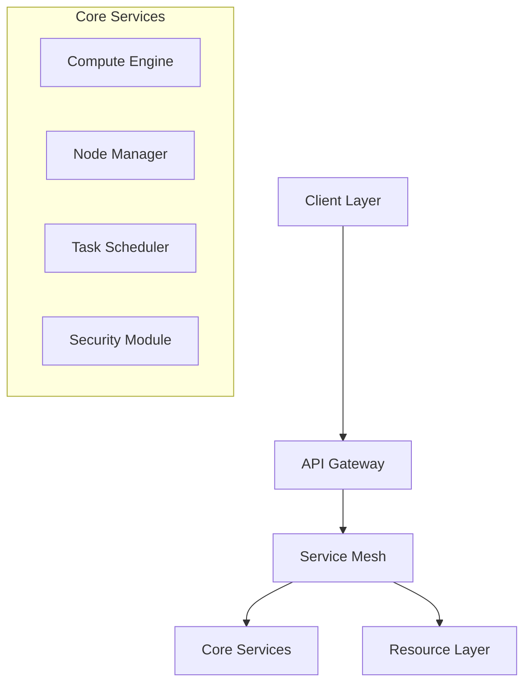

 Neurolov's GPU network and compute distribution system:

GPU Connection & Onboarding:

1. Browser-Based Connection:
```typescript
class WebGPUManager {
  private device: GPUDevice;
  private queue: GPUQueue;
  
  async initialize() {
    if (!navigator.gpu) {
      throw new Error('WebGPU not supported');
    }
    const adapter = await navigator.gpu.requestAdapter();
    this.device = await adapter.requestDevice();
    this.queue = this.device.queue;
  }
}
```

The system uses WebGPU for browser-based GPU access, requiring no installation. Both individual GPUs and GPU farms can connect through:
- Direct browser integration for individual users
- API integration for GPU farms (supporting 100+ GPUs)
- Automated node discovery and registration

Task Distribution & Management:

```typescript
class DistributedTaskScheduler {
  async scheduleTask(task: TaskDefinition): Promise<string> {
    const availableNodes = this.getAvailableNodes(task.requirements);
    const optimalNode = this.selectOptimalNode(availableNodes, task);
    return this.assignTaskToNode(task, optimalNode);
  }
}
```

The system handles tasks through:
- Dynamic workload distribution based on GPU capabilities
- Real-time performance monitoring
- Automatic failover if GPUs disconnect
- Task queueing and priority management

Revenue Model:
1. GPU Providers earn through:
- Compute power contribution (measured in TFLOPS)
- Uptime rewards
- Task completion bonuses
- Network participation rewards

2. Task Providers pay based on:
- Compute resources used
- Task priority level
- Duration of computation
- Resource requirements

Device Analysis & Requirements:
```typescript
interface NodeInfo {
  hardware: {
    gpu: {
      model: string;
      memory: number;
      compute: number;
    };
    network: {
      bandwidth: number;
      latency: number;
    }
  };
  capabilities: string[];
}
```

- Minimum 4-hour connection duration recommended
- Automatic hardware capability detection
- Performance benchmarking on connection
- Regular health checks and monitoring

Disconnection Handling:
- Automatic task redistribution
- State preservation
- Reward calculation for partial work
- Reconnection without data loss

Network Architecture:


The system creates a distributed compute network with:
- Edge nodes (individual GPUs)
- Core nodes (GPU farms)
- Gateway nodes (load balancers)
- Real-time task distribution

This architecture enables efficient resource sharing while maintaining security and performance. Would you like me to elaborate on any specific aspect?
